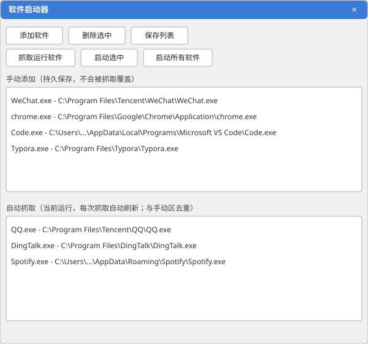

<p align="center"></p>

# 软件启动器 (AppStarter)

> 一键保存 / 复活你正在用的所有软件。Windows 专用，单文件、免安装。

每天开电脑、回来上班，都要把微信、浏览器、编辑器、音乐……一个个手动打开？
软件启动器帮你把「当前正在跑的软件」一键记下来，第二天（或重启后）一键全部拉起。

## ✨ 核心功能

- **手动添加**：文件对话框选 `.exe`，或把 `.exe` / `.lnk` 快捷方式直接拖进窗口。
- **自动抓取**：点一下「抓取运行软件」，自动记录当前所有**有可见窗口**的进程（已排除系统进程与常见辅助进程，并与手动区去重）。
- **一键启动**：按列表顺序**错峰**（间隔 1 秒）启动全部软件，避免瞬间卡顿；结束后汇总成功 / 失败明细。
- **持久保存**：列表存到 `%APPDATA%/Local/AppStarter/apps.json`，关掉程序也不丢。
- **开机自启**：打开「开机自启」开关，程序自动写入 Windows 启动项（`HKCU Run`），登录即自动运行；关掉即可移除。
- **开机自动恢复**：打开「开机后自动恢复」开关，登录延迟几秒后自动把保存的列表全部拉起，**开机即就绪，什么都不用点**。
- **单独启动**：双击任意图标卡片，单独拉起该软件。
- **应用图标**：自动从每个 `.exe` 提取 64×64 高清图标，卡片式网格展示，不再是枯燥的路径文字。

## 🖼 界面预览



> 上为界面示意（SVG 还原布局）。你可以用 `Win + Shift + S` 截取真实运行图后替换 `screenshots/preview.svg`。

## 📦 安装

### 方式一：下载预编译（推荐，零门槛）
到 [Releases](../../releases) 页面下载 `AppStarter.exe`，**双击即可运行**。

> 运行需要系统已安装 **WebView2 Runtime** —— Windows 11 与 Windows 10 21H2 及以上版本自带，
> 老版本 Windows 10 可到 [微软官网](https://developer.microsoft.com/microsoft-edge/webview2/) 下载安装。

### 方式二：从源码构建
环境要求：Windows + Go 1.25+

```bash
# 1. 安装 Wails CLI
go install github.com/wailsapp/wails/v2/cmd/wails@latest

# 2. 构建（产物在 build/bin/AppStarter.exe）
wails build -platform windows/amd64
```

开发调试（改前端即时生效，带 DevTools）：

```bash
wails dev
```

## 🚀 使用

1. **添加常用软件**：点「添加软件」选 `.exe`，或直接把程序 / 快捷方式拖进窗口。
2. **下班 / 重启前**：点「抓取运行软件」，把当前开着的所有软件快照保存下来。
3. **第二天 / 开机后**：点「启动全部」，按顺序一键全部复活。
4. **手动添加区**用于「固定常用」，**自动抓取区**用于「临时快照」，两者自动去重，不会重复启动。
5. **全自动（可选）**：打开「开机自启」+「开机后自动恢复」，从此每天开机自动恢复，连 AppStarter 都不用打开。

## 🛠 技术栈

- **Go 1.25**
- [Wails v2](https://wails.io/) —— Go 后端 + Web 前端，WebView2 渲染，打包为单个 exe
- **前端**：原生 HTML / CSS / JavaScript（无 npm 构建步骤，改完直接 `wails build`）
- 配置持久化：`encoding/json` → `%APPDATA%/Local/AppStarter/apps.json`
- 图标提取：`SHDefExtractIcon` → 32bpp 位图 → PNG → base64 data URL 传给前端
- 抓取逻辑：PowerShell `Get-Process` 取有窗口进程 + 过滤规则

### 项目结构

```
main.go              Wails 入口（embed frontend）
app.go               后端逻辑，导出方法自动暴露给前端
frontend/
  index.html         页面结构
  style.css          样式
  app.js             交互逻辑
  wailsjs/           wails build 自动生成的前端绑定
wails.json           Wails 项目配置
build/appicon.png    应用图标（CI 从 assets/logo.png.b64 还原）
```

## ⚠️ 局限 / 已知问题

- **仅支持 Windows**（Wails WebView2 + 注册表 + PowerShell 均为 Windows 特性）。
- **依赖 WebView2 Runtime**：Win11 / Win10 21H2+ 自带；更老的系统需单独安装。
- **「自动抓取」是启发式**：基于「有可见主窗口的进程」判断，可能漏掉无窗口的后台工具；已排除系统目录与 `crashpad/helper/updater/service` 等辅助进程，但仍非 100% 精准。

## 🤝 贡献

欢迎提 Issue / PR。本地开发只需 Windows + Go 1.25+ 与 Wails CLI，执行 `wails dev` 即可边改边看。

## 📄 许可证

[MIT](LICENSE) —— 随便用、随便改，留个版权声明即可。
